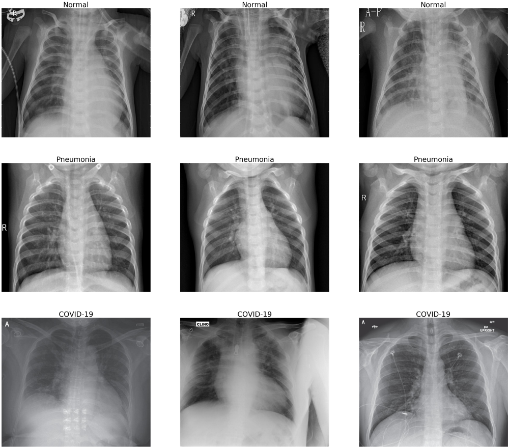

# Diagnosing COVID 
## Using Classification of Ground Glass Opacities in CT scans   

[skiaie@cloudera.com](mailto:skiaie@cloudera.com)

 

	

### Summary

1. Chest CT has a high sensitivity for diagnosis of COVID-19.
2. Given the limitation in availability of PCR tests, CT scans represent a path to augmenting the existing diagnostic toolsets in the diagnosis of COVID-19
3. However, accuracy and Specificity of CT scans is limited.  
4. To overcome this limitation, CT scans, can be augmented with patient chart data to validate 
 - Acute viral symptomologies
 - Presentation absent non-COVID specific symptomologies 

This repository demonstrates the use of Image classification to identify Ground Glass Opacities, in patients, for use in diagnosis.  

Follow the instructions below, for setup: 

https://github.com/hortonworks-sk/CDSW-Melanoma2